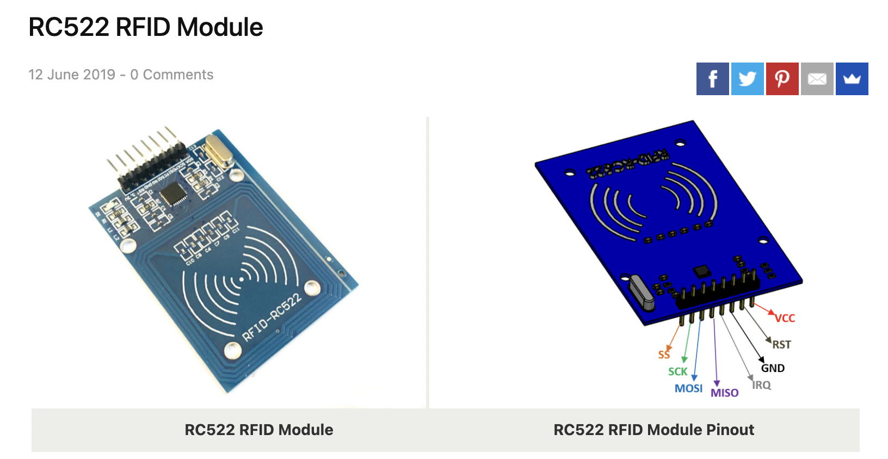
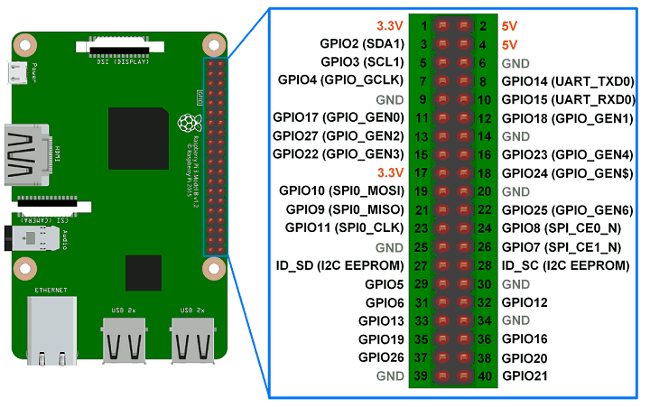

# Raspberry Pi - RFID Spotify Jukebox


## Description
Ths project employs the [spotipy](https://spotipy.readthedocs.io/en/2.19.0/) Python library to interface with the Spotify web application to create a functional RFID Spotify Jukebox. This Github repository will contain the steps towards creating a functional spotify application as well as containing the *.stl* files that I 3D printed as well as the Bill of Materials (BOM).

---
## Table of Contents
- [Bill of Materials](#bill-of-materials)
    - [Raspberry Pi](#raspberry-pi)
    - [RFID Card Reader](#rfid-card-reader)
    - [Miscellaneous Parts](#miscellaneous-parts)
- [Installation and Setup](#installation-and-setup)
    - [Initial Set-up](#initial-set-up)
    - [RC522 Card Reading](#rc522-card-reading)
    - [Connecting Raspberry Pi to Spotify](#connecting-raspberry-pi-to-spotify)
    - [Setting up Developer Spotify API](#setting-up-developer-spotify-api)
    - [Installing Spotipy](#installing-spotipy)
    - [Adding Playlists/Songs to RFID Cards](#adding-playlistssongs-to-rfid-cards)
    - [Enabling Spotipy Script on Boot](#enabling-spotipy-script-on-boot)
- [Credits](#credits)
- [License](#license)

---
## Bill of Materials
Listed below are the bare minimum parts required for a functioning Raspberry Pi RFID Spotify jukebox, with associated links:
- ### Raspberry Pi
    There are several Raspberry Pi's that can be used, but ultimately depend on the implementation
    - [Raspberry Pi 4 Model B](https://www.raspberrypi.com/products/raspberry-pi-4-model-b/)
    - [Raspberry Pi 3 Model B+](https://www.raspberrypi.com/products/raspberry-pi-3-model-b-plus/)
    - [Raspberry Pi 3 Model B](https://www.raspberrypi.com/products/raspberry-pi-3-model-b/)

- ### RFID Card Reader
    It is best to use a [RC522 RFID](https://medium.com/autonomous-robotics/an-introduction-to-rfid-dc6228767691) due to its supported Python library module. You can pick one up [here](https://www.amazon.com/dp/B07VLDSYRW?psc=1&ref=ppx_yo2ov_dt_b_product_details).

- ### Miscellaneous Parts
    - **Speaker**: in this build I used a [JBL Flip 3](https://www.amazon.com/JBL-FLIP3-Bluetooth-Speaker-Black/dp/B010RWAIAC) that I purchased on a Black Friday Deal for $30, any speaker will suffice - edits to the 3D prints will be needed with a different speaker configuration
    - **Button**: to skip tracks, play/pause tracks I used [Tactile Push Button Switch](https://www.amazon.com/QTEATAK-Momentary-Tactile-Button-Switch/dp/B07VSNN9S2/ref=asc_df_B07VSNN9S2/?tag=hyprod-20&linkCode=df0&hvadid=416673008856&hvpos=&hvnetw=g&hvrand=4635310657359385198&hvpone=&hvptwo=&hvqmt=&hvdev=c&hvdvcmdl=&hvlocint=&hvlocphy=9029679&hvtargid=pla-898093476441&psc=1&tag=&ref=&adgrpid=95471650978&hvpone=&hvptwo=&hvadid=416673008856&hvpos=&hvnetw=g&hvrand=4635310657359385198&hvqmt=&hvdev=c&hvdvcmdl=&hvlocint=&hvlocphy=9029679&hvtargid=pla-898093476441) or a suitable alternative
    - **Audio Jack Splitter**: To allow external speaker player I got this audio jack that will mount into the 3D printed frame [Audio Jack Splitter](https://www.amazon.com/Kingtop-Adapter-Tablet-Headsets-Version/dp/B01I3A47I4/ref=sr_1_1_sspa?keywords=audio%2Bjack%2Bsplitter&qid=1650606648&sr=8-1-spons&smid=A30K982V62WUOW&spLa=ZW5jcnlwdGVkUXVhbGlmaWVyPUEzUVg5UDM3OEw0VkVBJmVuY3J5cHRlZElkPUEwMjAyMDU1Mkw5R1RLRDdDWk1GTyZlbmNyeXB0ZWRBZElkPUEwOTA3MjkyNDJVV0NJWDhVOVFQJndpZGdldE5hbWU9c3BfYXRmJmFjdGlvbj1jbGlja1JlZGlyZWN0JmRvTm90TG9nQ2xpY2s9dHJ1ZQ&th=1)
    - **RFID Tags**: Link [here](https://www.amazon.com/dp/B01LZYOR7P?psc=1&ref=ppx_yo2ov_dt_b_product_details)
    - **Blank Cards**: Link [here](https://www.amazon.com/dp/B07193KG7G?ref=ppx_yo2ov_dt_b_product_details&th=1)
    - **Threaded inserts**: Link [here](https://www.amazon.com/dp/B08Z86Z85R?psc=1&ref=ppx_yo2ov_dt_b_product_details)
    - **Dupont Connectors**: Link [here](https://www.amazon.com/dp/B089FZ79CS?psc=1&ref=ppx_yo2ov_dt_b_product_details)
    - **Protoboard**: Link [here](https://www.amazon.com/dp/B07FFDFLZ3?psc=1&ref=ppx_yo2ov_dt_b_product_details)
    - **Rubber Standoffs**: Link [here](https://www.amazon.com/dp/B08C373VBW?psc=1&ref=ppx_yo2ov_dt_b_product_details)
    - **Raspberry Pi PS Cable**: Link [here](https://www.amazon.com/dp/B01N336XEU?psc=1&ref=ppx_yo2ov_dt_b_product_details)


---
## Installation and Setup

### Initial Set-up
After a clean install of Raspberry Pi Dameon Linux
```
sudo apt-get update
sudo apt-get upgrade
```
Next type the following
```
sudo raspi-config
```
Raspi-config will open a window, from here select "Interfacing Options" and select "SPI" and enable "SPI"
```
sudo reboot
```

### RC522 Card Reading
To allow the reading of RFID tags, connect the MFRC522 module to the Raspberry Pi via the following pin out schematic
- **SS pin** connects to **GPIO8 pin**
- **SCK pin** connects to **GPIO11 pin**
- **MOSI pin** connects to **GPIO10 pin**
- **MISO pin** connects to **GPIO9 pin**
- **IRQ pin** does not connect to anything
- **GND pin** connects to **GND pin**
- **RST pin** connects to **GPIO23 pin**
- **VCC pin** connects to **3.3V Power pin**

Refer to the pins and connections below

Click here for more [RC522 Data](https://components101.com/wireless/rc522-rfid-module)



To allow for the RFID reading, install the following dependencies
```
sudo apt-get install python3-dev python3-pip
sudo pip3 install spidev mfrc522
```
This will enable the Raspberry Pi to access the GPIO pins and read the HASH ID values from the RFID tags that can be used to link to playlists/albums/tracks later on. With these dependencies installed *readCard.py* should be able to run and will output the HASD ID values.

### Connecting Raspberry Pi to Spotify
To enable the Raspberry Pi to be a valid connection on Spotify, the [Raspotify - Spotify Connect](https://github.com/dtcooper/raspotify) client will need to be installed - *be sure that all dependencies are met else connect will not work*- to install use the folllowing command
```
sudo apt-get -y install curl && curl -sL https://dtcooper.github.io/raspotify/install.sh | sh
```
While the Raspberry Pi is on and connected to internet, it should be recognized by Spotify as a valid connection device (analogous to a bluetooth speaker, a separate device, etc). Test functionality by opening Spotify on a phone or laptop and click the **Connect** button and search for "Raspotify" in the options.
### Setting up Developer Spotify API
Next step is too allow the Raspberry Pi to interface with Spotify's web API and allow the Raspberry Pi to change music per the RFID values. To allow *spotipy* to integrate with the Spotify web API, API tokens are required, to obtain them do the following:


1. Navigate to https://developer.spotify.com/dashboard
2. Sign in with a Spotify Premium Account
3. Click "Create an App"
4. Click on your app
5. Click on "Edit Settings"
6. Add the following callback URIs
```
http://localhost:8888/callback
http://localhost:8080 
```
7. On the dashboard, write/copy the Client ID and Client Secret, they are needed later

Next is to get the Device ID of the Raspberry Pi, this can be found after connecting the Raspberry Pi via Spotify Connect

1. On a phone or laptop, open Spotify and connect to "Raspotify"
2. Navigate to https://developer.spotify.com/console/get-users-available-devices/
3. Click get token
4. Check all the boxes under "Required Scopes for this endpoint"
5. Click "Request Token"
6. Underneath the Get token option, click "Try It" to make an API call and get the list of Spotify devices on your home network
7. In the json response, find the ID for the Raspotify (Raspberry Pi) device
8. Write/copy the Device ID

### Installing Spotipy
Spotipy is a lightweight python library for the Spotify web API, click here for [Spotipy Documentation](https://spotipy.readthedocs.io/en/2.19.0/)
```
pip install spotipy
```
Once that installs, we can start writing our first python program to control Spotify on Raspberry Pi.

1. In your main folder, open *parseSpotify.py*
2. Change the Device ID, Client ID, and Client Secret to the tokens provided by Spotify
3. Execute this script
4. A Spotify webpage will open where you have to agree/accept to authenticate. Click agree, this is a one-time setup
5. Once authenticated, the song in *parseSpotify.py* will start playing through the Raspberry Pi speakers

### Adding Playlists/Songs to RFID Cards
With everything up to this point being completed, the Raspberry Pi is ready to play music! Change the token values in *main.py* to match the tokens provided to you from Spotify. From here songs/albums/playlists can be added to the *CardData.json* through the following format shown below:
```
{
    "HASH ID #1 FROM RFID CARD":{
        "name":"Road Trips",
        "url":"spotify:playlist:1LxEqGRyNV5yB67e6mwGgH",
        "type": "Playlist"
    },
    "HASH ID #2 FROM RFID CARD":{
        "name":"California 37",
        "url":"spotify:album:5zseibu9WEsPaZmkJUMkz1",
        "type": "Album"
    },
    "HASH ID #3 FROM RFID CARD":{
        "name":"Beautiful Mistakes",
        "url":"spotify:track:5zFglKYiknIxks8geR8rcL",
        "type": "Track"
    },
}
```
Where *HASH ID* can be found by running the *readCard.py* script and copying/pasting the RFID HASH ID into *CardData.json* and where *"type"* can be either *Playlist, Album, or Track* as per the Spotify URL. Obtaining the URL can be done simply by:


Copying this link gives *https://open.spotify.com/track/4HlFJV71xXKIGcU3kRyttv?si=b945f2f735874dd0* but all that is is needed can be spliced is after the *spotify.com/"type"/* up to the *"?"* such that this track's ID is **4HlFJV71xXKIGcU3kRyttv**. Hence, the value for the card's URL is
```
{
    "name":"Hey, Soul Sister",
    "url":"spotify:track:4HlFJV71xXKIGcU3kRyttv",
    "type": "Track"
}
```
**Note: The type must be correct as album/playlist use a different API call than track, the name can be left blank**

### Enabling Spotipy Script on Boot
Enabling the python script to auto-run on boot can be done by using *crontab* to run a shell script that starts the script on boot. For detailed instructions, refer to [Raspberry Pi Launch Python Script on Startup](https://www.instructables.com/Raspberry-Pi-Launch-Python-script-on-startup/)

---
## Printing Album Art
Included in this repository is the *genPhotos.py* file that will automatically generate the album art to be printed, cut out and pasted onto a blank card to pose as a modern record. All that is required is enabling the *boolean* to automatically pull the album art from Spotify - else you'll have to manually populate the album cover art folder with photos of your choice.


## 3D Printing Jukebox

---
## Credits
This repository and project is based upon the work of [talaexe's Sptoify-RFID-Record-Player](https://github.com/talaexe/Spotify-RFID-Record-Player) and expanded upon to allow more features and scalability. Additionally, this work extensively uses [Spotipy](https://spotipy.readthedocs.io/en/2.19.0/) of which is the Python library that allows Web API calls to Spotify. Finally, this also extensively uses the [Raspotify](https://github.com/dtcooper/raspotify) library to integrate with Raspberry Pi and Spotify to allow music playing.

## License
Attribution-NonCommercial-ShareAlike 4.0 International (CC BY-NC-SA 4.0) prohibits the use of this for commercialization, but allows downloading editing/sharing amongst the community. If there is a request to commercialize, contact me personally via email at [dcard@umich.edu](mailto:dcard@umich.edu)

