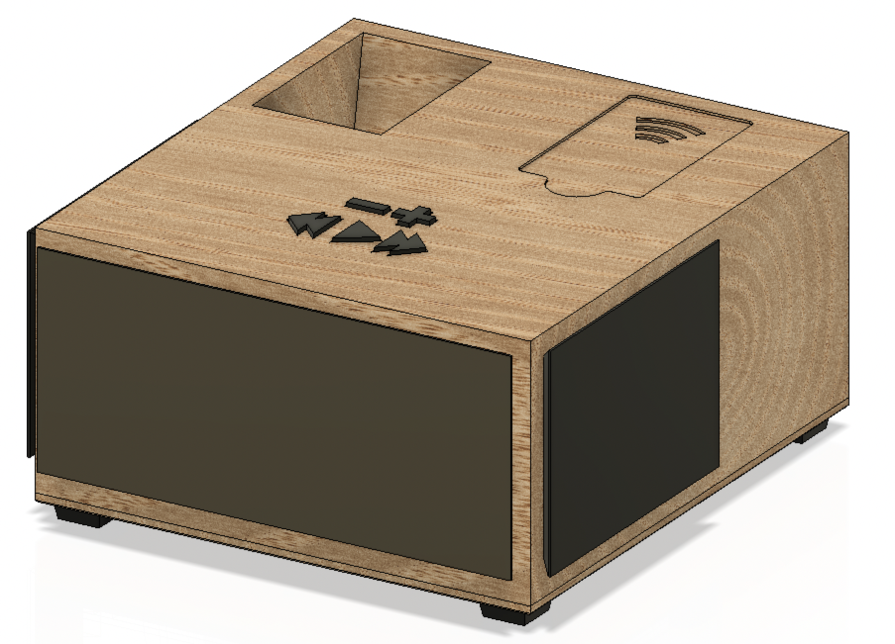
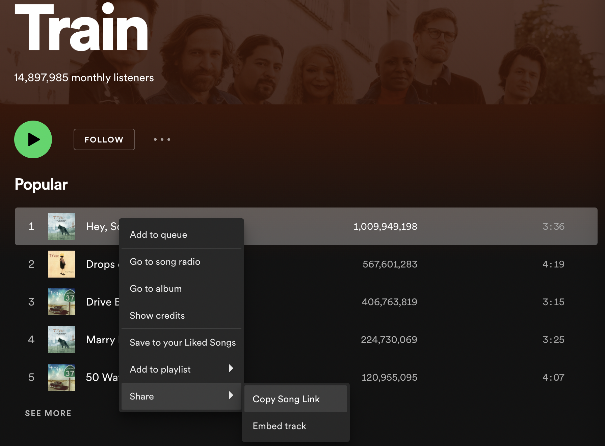

# Raspberry Pi - RFID Spotify Jukebox


## Description
Ths project employs the [spotipy](https://spotipy.readthedocs.io/en/2.19.0/) Python library to interface with the Spotify web application to create a functional RFID Spotify Jukebox. This Github repository will contain the steps towards creating a functional spotify application as well as containing links to the thingiverse repository of the *.stl* files that I 3D printed as well as the Bill of Materials (BOM).

---
## Table of Contents
- [Bill of Materials](#bill-of-materials)
    - [Raspberry Pi](#raspberry-pi)
    - [RFID Card Reader](#rfid-card-reader)
    - [Miscellaneous Parts](#miscellaneous-parts)
- [Installation and Setup](#installation-and-setup)
    - [Installing Spotipy](#installing-spotipy)
    - [Setting up Developer Spotify App](#setting-up-developer-spotify-app)
    - [Initial Set-up](#initial-set-up)
    - [Adding Playlists/Songs to RFID Cards](#adding-playlistssongs-to-rfid-cards)
    - [Enabling Spotipy Script on Boot](#enabling-spotipy-script-on-boot)
- [Credits](#credits)
- [License](#license)

---
## Bill of Materials
Listed below are the bare minimum parts required for a functioning Raspberry Pi RFID Spotify jukebox, with associated links:
- ### Raspberry Pi
    There are several Raspberry Pi's that can be used, but ultimately depend on the implementation
    - [Raspberry Pi Zero W](https://www.raspberrypi.com/products/raspberry-pi-zero-w/) Does not ship with an audio jack, so must be used with a bluetooth capable speaker
    - Any of the following [Raspberry Pi 4 Model B](https://www.raspberrypi.com/products/raspberry-pi-4-model-b/), [Raspberry Pi 3 Model B+](https://www.raspberrypi.com/products/raspberry-pi-3-model-b-plus/), [Raspberry Pi 3 Model B](https://www.raspberrypi.com/products/raspberry-pi-3-model-b/)

- ### RFID Card Reader
    It is best to use a [RC522 RFID](https://medium.com/autonomous-robotics/an-introduction-to-rfid-dc6228767691) due to its supported Python library module

- ### Miscellaneous Parts
    - **Speaker**: in this build I used a [JBL Flip 3](https://www.amazon.com/JBL-FLIP3-Bluetooth-Speaker-Black/dp/B010RWAIAC) that I purchased on a Black Friday Deal for $30, any speaker will suffice - edits to the 3D prints will be needed with a different speaker configuration
    - **Button**: to skip tracks, play/pause tracks I used [Tactile Push Button Switch](https://www.amazon.com/QTEATAK-Momentary-Tactile-Button-Switch/dp/B07VSNN9S2/ref=asc_df_B07VSNN9S2/?tag=hyprod-20&linkCode=df0&hvadid=416673008856&hvpos=&hvnetw=g&hvrand=4635310657359385198&hvpone=&hvptwo=&hvqmt=&hvdev=c&hvdvcmdl=&hvlocint=&hvlocphy=9029679&hvtargid=pla-898093476441&psc=1&tag=&ref=&adgrpid=95471650978&hvpone=&hvptwo=&hvadid=416673008856&hvpos=&hvnetw=g&hvrand=4635310657359385198&hvqmt=&hvdev=c&hvdvcmdl=&hvlocint=&hvlocphy=9029679&hvtargid=pla-898093476441) or a suitable alternative
    - **Audio Jack Splitter**: To allow external speaker player I got this audio jack that will mount into the 3D printed frame [Audio Jack Splitter](https://www.amazon.com/Kingtop-Adapter-Tablet-Headsets-Version/dp/B01I3A47I4/ref=sr_1_1_sspa?keywords=audio%2Bjack%2Bsplitter&qid=1650606648&sr=8-1-spons&smid=A30K982V62WUOW&spLa=ZW5jcnlwdGVkUXVhbGlmaWVyPUEzUVg5UDM3OEw0VkVBJmVuY3J5cHRlZElkPUEwMjAyMDU1Mkw5R1RLRDdDWk1GTyZlbmNyeXB0ZWRBZElkPUEwOTA3MjkyNDJVV0NJWDhVOVFQJndpZGdldE5hbWU9c3BfYXRmJmFjdGlvbj1jbGlja1JlZGlyZWN0JmRvTm90TG9nQ2xpY2s9dHJ1ZQ&th=1)


---
## Installation and Setup

### Initial Set-up
After a clean install of Raspberry Pi Dameon Linux
```
sudo apt-get update
sudo apt-get upgrade
```
Next type the following
```
sudo raspi-config
```
Raspi-config will open a window, from here select "Interfacing Options" and select "SPI" and enable "SPI"
```
sudo reboot
```
#### Installing Spotipy
Spotipy is a lightweight python library for the Spotify web API, click here for [Spotipy Documentation](https://spotipy.readthedocs.io/en/2.19.0/)
```
pip install spotipy
```
or upgrade
```
pip install spotipy --upgrade
```
### Setting up Developer Spotify App


### Adding Playlists/Songs to RFID Cards
Songs/albums/playlists can be added to the *CardData.json* through the following format shown below:
```
{
    "HASH ID #1 FROM RFID CARD":{
        "name":"Road Trips",
        "url":"spotify:playlist:1LxEqGRyNV5yB67e6mwGgH",
        "type": "Playlist"
    },
    "HASH ID #2 FROM RFID CARD":{
        "name":"California 37",
        "url":"spotify:album:5zseibu9WEsPaZmkJUMkz1",
        "type": "Album"
    },
    "HASH ID #3 FROM RFID CARD":{
        "name":"Beautiful Mistakes",
        "url":"spotify:track:5zFglKYiknIxks8geR8rcL",
        "type": "Track"
    },
}
```
Where *"type"* can be either *Playlist, Album, or Track* as per the Spotify URL. Obtaining the URL can be done simply by:


Copying this link gives *https://open.spotify.com/track/4HlFJV71xXKIGcU3kRyttv?si=b945f2f735874dd0* but all that is is needed can be spliced is after the *spotify.com/"type"/* up to the *"?"* such that this track's ID is **4HlFJV71xXKIGcU3kRyttv**. Hence, the value for the card's HASH ID is
```
{
    "name":"Hey, Soul Sister",
    "url":"spotify:track:4HlFJV71xXKIGcU3kRyttv",
    "type": "Track"
}
```
**Note: The type must be correct as album/playlist use a different API call than tracks**

### Enabling Spotipy Script on Boot
---
## Credits
Thx 
## License
Attribution-NonCommercial-ShareAlike 4.0 International (CC BY-NC-SA 4.0) prohibits the use of this for commercialization, but allows downloading editing/sharing amongst the community. If there is a request to commercialize, contact me personally via email at [dcard@umich.edu](mailto:dcard@umich.edu)

